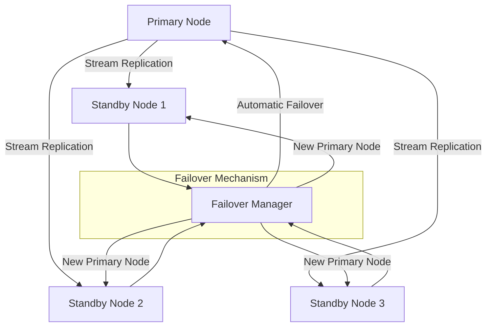

# PostgreSQL High Availability Setup on Red Hat Enterprise Linux (RHEL)

## Objective

The objective of this project is to set up a high-availability PostgreSQL cluster on Red Hat Enterprise 
Linux (RHEL) using streaming replication and automatic failover. This setup aims to ensure that the 
PostgreSQL database remains available and resilient to server failures.



## Project Overview

1. **Planning and Preparation**
   - Define requirements and objectives.
   - Prepare the RHEL environment.
   - Install and configure necessary packages.

2. **PostgreSQL Installation**
   - Install PostgreSQL on primary and standby nodes.
   - Initialize and configure PostgreSQL for replication.

3. **Configuration**
   - Set up streaming replication.
   - Configure failover using tools like `pgpool-II` or `repmgr`.

4. **Testing and Validation**
   - Test replication and failover scenarios.
   - Validate high-availability setup.

5. **Documentation and Conclusion**
   - Document the setup process.
   - Evaluate benefits, challenges, and performance.

## Step-by-Step Configuration

### 1. Planning and Preparation
- **Install RHEL**: Ensure RHEL is installed and updated.
- **Update System**:
 ```bash
  sudo yum update -y
```

### 2. PostgreSQL Installation

-   **Install PostgreSQL on Primary Node**:
```bash
sudo yum install @postgresql -y
```

- **Install PostgreSQL on Standby Node**:
```bash
sudo yum install @postgresql -y
```

### 3. Configure Streaming Replication

#### On the Primary Node

**Edit PostgreSQL Configuration**:
Open `/var/lib/pgsql/<version>/data/postgresql.conf` and set the following:

```bash
wal_level = replica
max_wal_senders = 3
wal_keep_size = 64MB
```
Open `/var/lib/pgsql/<version>/data/pg_hba.conf` and add:

```bash
host replication all <standby_node_ip>/32 md5
```

**Create Replication User**:

```bash
sudo -i -u postgres
psql -c "CREATE ROLE replicator WITH REPLICATION LOGIN ENCRYPTED PASSWORD 'password';"
```
**Restart PostgreSQL**:

```bash
sudo systemctl restart postgresql-<version>
```

#### On the Standby Node

**Stop PostgreSQL Service**:
```bash
sudo systemctl stop postgresql-<version>
```
**Backup Primary Node Data**:

```bash
pg_basebackup -h <primary_node_ip> -D /var/lib/pgsql/<version>/data -U replicator -P --wal-method=stream
```
**Create `recovery.conf` **:
```bash
sudo -i -u postgres
echo "standby_mode = 'on'" > /var/lib/pgsql/<version>/data/recovery.conf
echo "primary_conninfo = 'host=<primary_node_ip> port=5432 user=replicator password=password'" >> 
/var/lib/pgsql/<version>/data/recovery.conf
```

**Start PostgreSQL Service**:

```bash
sudo systemctl start postgresql-<version>
```

### 4. Configure Failover

#### Using `pgpool-II` (Optional)

**Install `pgpool-II`**:

```bash
sudo yum install pgpool-II -y
```

**Configure `pgpool-II`**: Edit `/etc/pgpool-II/pgpool.conf` to set up backend nodes and failover 
configurations.

#### Using `repmgr` (Alternative)
**Install `repmgr`**:

```bash
sudo yum install repmgr -y
```

**Configure `repmgr`**: Follow the `repmgr` documentation to configure primary and standby nodes for 
automatic failover.


### 5. Testing and Validation

-   **Test Replication**:
    -   Insert data into the primary database and check if it appears on the standby.
-   **Test Failover**:
    -   Simulate a failure on the primary node and verify that the standby node takes over.
-   **Validate Setup**:
    -   Ensure replication and failover work as expected.

### 6. Documentation and Conclusion

-   **Document Configuration**: Record the installation and configuration steps.
-   **Evaluate Benefits**:
    -   **High Availability**: Ensures continuous database service.
    -   **Automatic Failover**: Minimizes downtime during failures.
-   **Challenges**:
    -   **Complex Configuration**: Setting up and tuning replication and failover.
    -   **Monitoring and Maintenance**: Requires regular monitoring and maintenance.


